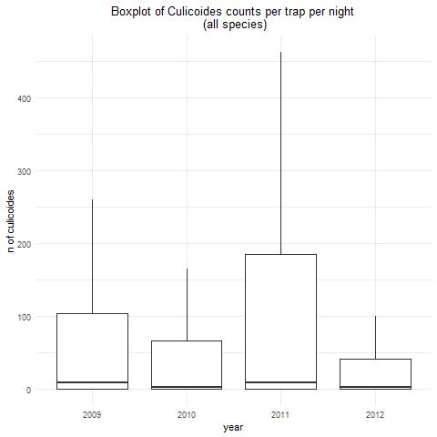
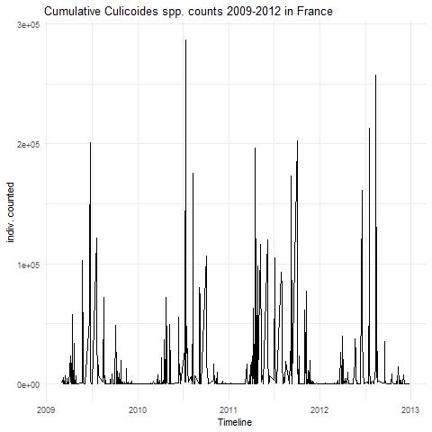
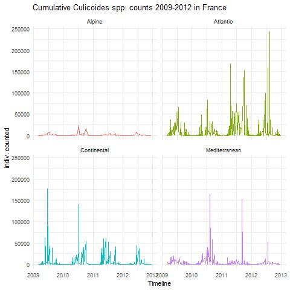
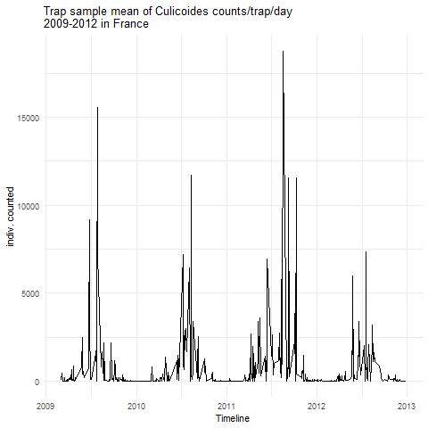
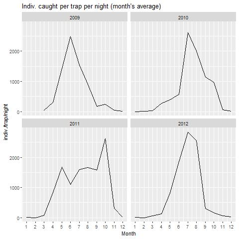
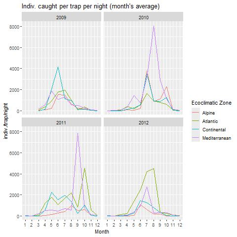
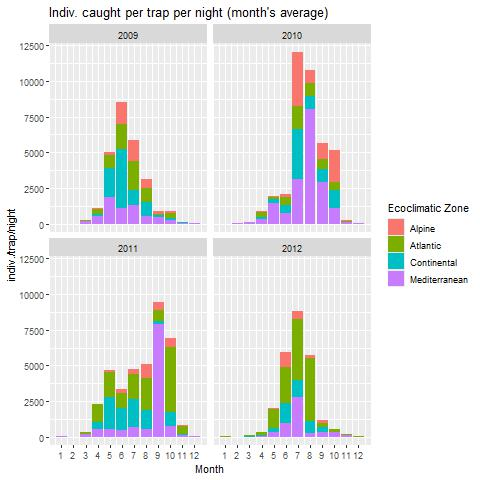

# _Culicoides_ML_

# 2025 Internship subject: **Spatio-temporal modeling of Culidcoides populations in France using Machine Learning**

## Scripts
- `covariates_hist_timeseries.R`
    **Rstudio script for primary data preprocessing and some basic visualisation such as histograms and timeseries**
- `covariates_boxplots.R`
    **Rstudio script for boxplots**
- `spatial_covariates.R`
    **Rstudio script for spatial data visualisation + some boxplots (need to transfer them to covariates_jeuxdedonnees script)**
## Description

## Visuals
**
 <mark>1. Boxplots</mark>** 

        Culidoides spp. counts per trap per night 2009-2012

        With Ecolimatic zones

-----------------------------------
        Culicoides spp. counts per trap per night for each month

        With Ecoclimatic zones

-----------------------------------
**
 <mark>2. Histograms</mark>** 

        Histogram of Culicoides spp. counts per trap per night 2009-2012 with mean and median

        With separate years

        With separate years and Ecoclimatic zones

-----------------------------------
**
 <mark>3. Timeseries</mark>** 

        Temporal changes of TOTAL daily counts of Culidoides spp. per each sampling day

        With Ecoclimatic Zones

----------------------------------
        Temporal changes of mean daily counts of Culidoides spp. per trap per each sampling day

----------------------------------
**
Various ways to present the same data** 

        Standardized counts of Culidoides spp. per trap per each sampling day (month's mean)

         With Ecoclmatic Zone

        Same data but barcharts

         Barcharts with Ecoclimatic zone

-----------------------------------
**
 <mark>4. Maps</mark>** 
>

----------------------------------
## Roadmap
# **Culicoides project**

## **Backround**
- **Bibliography**
    - Culicoides in France since 2006
        - What trends were seen?
        - How were BTV and EHF introduced?
    - 2008 outbreak and 2015 reintroduction of arboviruses
        - Economic losses, current approaches to reduce spread
- Literature review of studies
    - Studies conducted so far
        - 2009-2012 period for France
        - 2015-2023 period for France
        - Foreign studies
    - Relation to Climate change
    - Challenges for studying *Culicoides*
        - Lifestyle related (cannot conduct lab experiments)
    - Findings so far
        - Species
        - Serotypes
        - Distribution
    - Current predictive models

## **Problematic**
- Current models not sufficient
    - Lack of robustness?
    - Low accuracy?
- Current projects/approaches to improve prediction/surveillance
- Alternative approaches
    - intro into ML

## **Relevance of this project**
- other projects with ML that have shown success (*Aedes spp*.)
- Could provide new information about environmental variables for epidemiological data and surveillance tactics:
    - will extract knowledge about variables at the very least, at most can predict

## **Methods**
- Data Exploration
    - Plots for visualising data distribution
        - Heatmaps
        - Histograms
        - Time series
    - Correlation maps
    - Feature weight plots
- VectorNet archives for new data
- Variable selection
- Model construction

## **Results**
- Describe temporal and spatial distribution of culicoides
- Data driven instead of knoweldge based - VectorNet data

## **Questions**
- Ecological determinants in culicoides pop. distribution?
- What contributed to BTV + EHD reemergence? Due to Culicoides population changes or introduction of new serotypes of virus?
- Why is there heterogeneity in distribution in ***local*** small scale?
- Do the ML models make sense in ecological and epidemiological terms?
- Am I predicting *Culicoides* complex distribution OR specific species?
- regions or times when the predictions work less well (AOA)
## Contributing

## Authors and acknowledgment

## Project status

